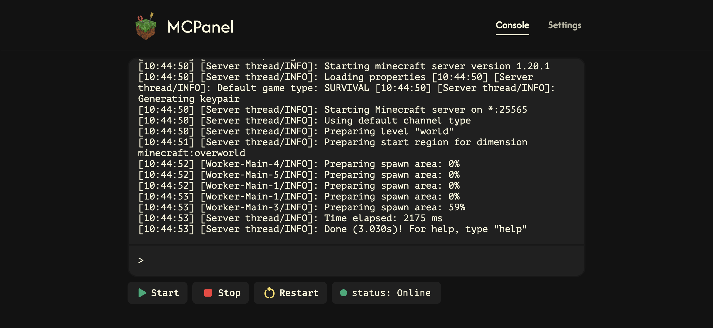
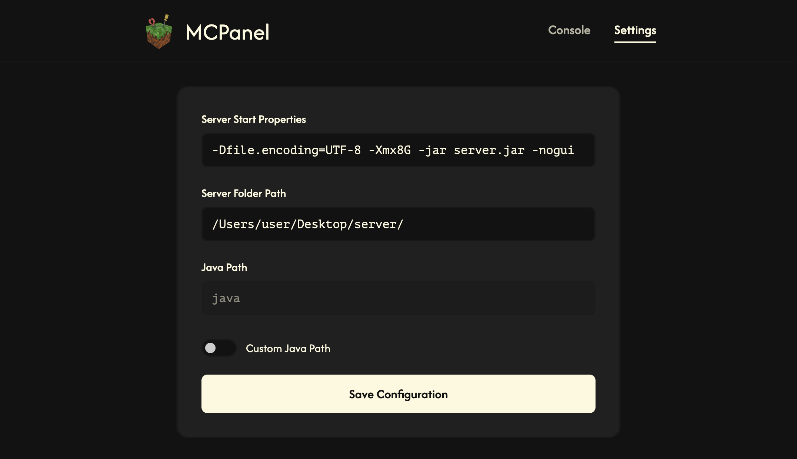

# MCPanel

MCPanel is a lightweight web panel for managing a Minecraft server without relying on `.bat` files or a terminal.


> ⚠️ **Security Warning:** MCPanel currently has **no** authentication or authorization. Anyone who can access the panel can control the Minecraft server and execute server commands. Do not expose MCPanel directly to the public internet. Use it only on localhost or a trusted local network.

## Tech Stack

- **Frontend:** Angular
- **Backend:** Node.js

## Requirements

- [Node.js](https://nodejs.org/) 22+
- [Angular CLI](https://angular.dev/tools/cli) 18+
- npm 10+


## Architecture

MCPanel is split into two independent applications: an Angular frontend and a Node.js backend.

```text
MCPanel/
│
├── backend/
│   ├── server.js          # Backend entry point
│   ├── config.json        # Backend configuration
│   ├── package.json
│   └── ...
│
├── frontend/
│   ├── public/
│   ├── src/
│   │   ├── app/
│   │   │   ├── console/   # Minecraft console interface
│   │   │   ├── navbar/    # Navigation bar
│   │   │   ├── settings/  # Panel settings
│   │   │   ├── app.component.*
│   │   │   ├── app.config.ts
│   │   │   └── app.routes.ts
│   │   ├── index.html
│   │   ├── main.ts
│   │   └── styles.css
│   ├── angular.json
│   ├── package.json
│   └── ...
│
└── README.md


## Installation

```bash
# Clone the repository
git clone https://github.com/Deniya96/MCPanel.git
cd mcpanel

# Install backend dependencies
cd backend
npm install

# Install frontend dependencies
cd frontend
npm install
```

## Running

Backend:

```bash
cd backend
node server.js
```

Frontend:

```bash
cd frontend
ng serve
```

Once running, the panel will be available at `http://localhost:4200`.

## Features

- Start and stop the Minecraft server
- View server console output
- Send commands to the server
- Configure Java executable and startup arguments
- Select the Minecraft server directory
- Monitor server status


## Screenshots

### Console



### Settings




## Configuration

The app has a settings panel with the following options:

| Setting | Description |
|---|---|
| **Server Start Properties** | Startup parameters/arguments passed to the Minecraft server process (e.g. JVM flags like `-Xmx`, `-Xms`, or additional launch arguments) when it's started via MCPanel. |
| **Server Folder Path** | Path to the folder containing your Minecraft server files (server jar, `server.properties`, world data, etc.). MCPanel uses this to know where to run the server from. |
| **Java Path** | Path to the Java executable used to launch the server. Useful if you have multiple Java versions installed and need the server to run on a specific one. |

## Platform Support

| OS | Status |
|---|---|
| Windows | ✅ Supported |
| macOS | ✅ Supported |
| Linux | ⚠️ Not tested |


## Disclaimer

MCPanel is an independent, unofficial tool. This project is **not an official Minecraft product** and is **not approved by or associated with Mojang or Microsoft**.

## License

This project is licensed under the MIT License — see the [LICENSE](LICENSE) file for details.


